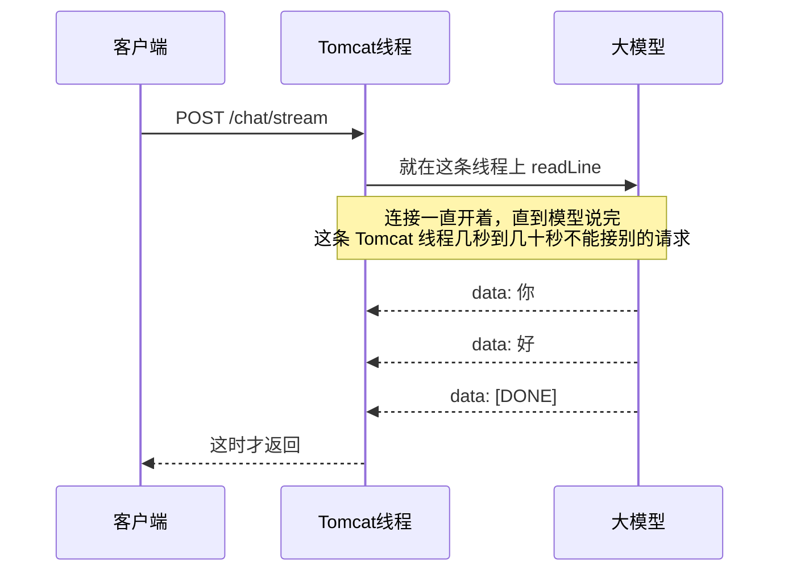
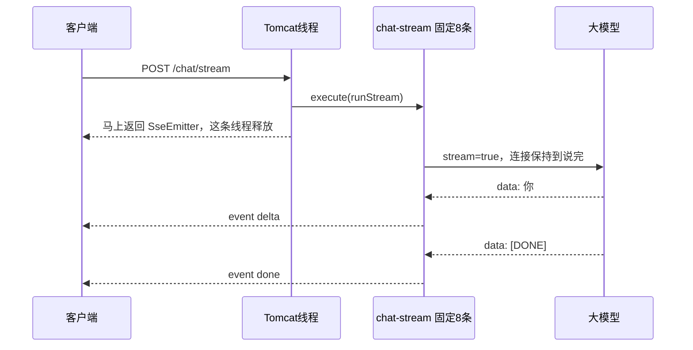
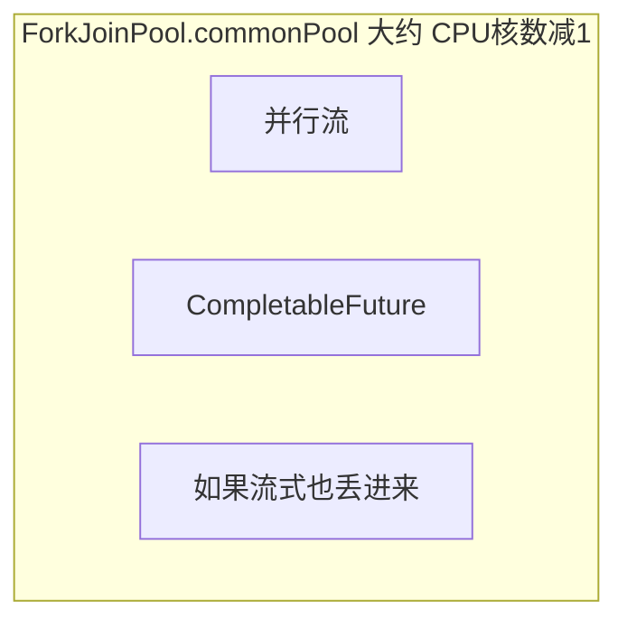

# 2026-09-23 · Project 0 流式、会话和连接

对应代码：`projects/project-0-llm-gateway/`。下面是这一轮提问和结论，按主题归档。

本地的 Redis 密码和 API Key 只留在 `application.yml`，没有写进笔记，也不进仓库。

---

## 历史超长时怎么裁

**问：** 历史长度上限（超了截断最早的几轮）当时没接到发出去的请求上，怎么做？

**结论：** 上限是 `app.llm.max-history-messages`，默认 20，一问一答算两条。超出后丢掉最早的**完整轮次**，不会从一轮中间切开，也不会让留下的历史以 assistant 开头。系统提示和当前这轮问题始终保留。

内存和 Redis 在写入时用同一套 `HistoryWindow`。`/chat` 发出去之前再裁一次，避免库里还留着超长历史。压缩（把早期轮次总结成一条）还没做，以后改 `HistoryWindow` 即可。

**我原以为**按条数从前面删就行。**实际上**只删一条会把「问」切掉、留下没有问题的「答」，模型会看到一段落单的回复。

---

## Redis 键的统一前缀

**问：** 连接上的 key 要有统一前缀。

**结论：** `app.redis.key-prefix` 默认 `llm-gateway`。业务代码仍写 `chat:session:{sessionId}`，`StringRedisTemplate` 在写出时加上前缀，真实 key 是 `llm-gateway:chat:session:{sessionId}`。末尾冒号可写可不写。留空则不加。

---

## 发给大模型的报文

**问：** 最终请求长什么样，并打印出来。

**结论：** `POST {base-url}/chat/completions`，`Content-Type: application/json`，密钥在 `Authorization: Bearer`。非流式正文大致是：

```json
{
  "model": "…",
  "messages": [
    {"role": "system", "content": "系统提示"},
    {"role": "user", "content": "历史问题"},
    {"role": "assistant", "content": "历史回答"},
    {"role": "user", "content": "当前问题"}
  ],
  "max_tokens": 4096,
  "stream": false
}
```

`temperature` 没设，就不会出现在报文里。每次调用会在日志里打 `llm request`，是真正发出去的 JSON，只做了换行。鉴权头不打印。流式时同一份报文里 `"stream": true`。

---

## SSE 是什么

**问：** 「正文按 SSE」是什么意思？

**结论：** SSE（Server-Sent Events）是一种 HTTP 正文格式。连接先不关，服务器把内容拆成一行一个事件推过来，而不是等全部生成完再给一整块 JSON。

上游流式正文长这样：

```text
data: {"choices":[{"delta":{"content":"你"}}]}

data: {"choices":[{"delta":{"content":"好"}}]}

data: [DONE]
```

`OpenAiSseDecoder` 跳过空行和 `:` 开头的注释，取出 `data:` 后面的文本，遇到 `[DONE]` 停止。

---

## StreamResponse 是干什么的

**问：** 仓库没有 Anthropic SDK，就没有 `StreamResponse`。还有别的方式吗？它到底干什么？

**结论：** `StreamResponse` 是 Anthropic Java SDK 的对象。一次流式调用返回它，由它把上游 SSE 拆成一段段文本。用完必须关掉，否则连接还开着，模型继续生成，token 继续计费。

这个项目走 OpenAI 兼容接口，同一件事自己做：`LlmClient.stream` 发 `stream=true`，`OpenAiSseDecoder` 逐行解析。客户端断开时关掉上游 `InputStream`，作用和关掉 `StreamResponse` 一样。

三条路做的是同一件事，差别只是谁来解析上游 SSE：

| 做法 | 谁解析 |
|---|---|
| Anthropic SDK 的 `StreamResponse` | SDK |
| 现在这套 `RestClient` + `OpenAiSseDecoder` | 自己 |
| Spring AI、LangChain4j 的 stream API | 那些框架 |

---

## 流式接口怎么把字推给客户端

**问：** 从大模型返回之后，什么时候主动推给客户端？`llmClient.stream(...)` 那一行和三个回调各干什么？

**结论：** `POST /chat/stream` 返回 `SseEmitter`，方法马上返回。真正的读取在 `chat-stream` 线程里。

`llmClient.stream` 有三个参数：

- `messages`：这次发给模型的完整内容
- `cancelled::get`：客户端是否已经断开。解码循环每读一行前问一次
- `new ChatStreamListener()`：读到结果后的回调

三个回调：

- `onUpstream`：连接刚建立，把上游响应体存下来，断开时才知道关哪条
- `onText`：来一小段文字。第一次记下时间（首字延迟），累加进回复，立刻 `emitter.send` 一个 `delta`
- `onFinish`：只记下结束原因（如 `stop`）。等流结束再放进 `done`

推送是同步的：`readLine()` 读到一行 → `onText` → `emitter.send`。没有另开队列等整段到齐。全部结束后发 `done`，里面有 `finishReason`、`ttftMs`、`elapsedMs`。

**怎么测：**

```bash
curl -N -X POST localhost:8090/chat/stream \
  -H 'Content-Type: application/json' \
  -d '{"sessionId":"s1","message":"用三句话解释一下事务的传播行为"}'
```

`-N` 关掉 curl 缓冲，字才会一段段出现。浏览器的 `EventSource` 只能发 GET，这个接口是 POST，所以用 curl。字还在冒时按 `Ctrl+C`，日志应出现 `chat stream cancelled`。

---

## 客户端断开时怎么停掉上游

**问：** 「关掉上游流，否则白烧 token」是怎么做的？

**结论：** 读流在 `chat-stream` 线程，断开发生在容器线程。两边用两个共享变量接上：`cancelled` 和 `upstream`。

`SseEmitter` 的完成、超时、出错都调用同一个 `cancel`：先把 `cancelled` 设为 true，再 `close()` 上游响应体。只改标记不够，因为 `readLine()` 会一直堵到下一行。关掉响应体，读取立刻被打断，HTTP 客户端断开和上游的连接，对方停止生成。

已经吐出的文字仍写入历史。一个字都没收到则不写，避免留下一句没有回答的用户消息。

---

## 为什么要单独的 chatStreamExecutor

**问：** 这个线程池干什么？为什么不能堵在 servlet 线程上？`ForkJoinPool.commonPool()` 是什么，和 Tomcat 怎么冲突？

**结论：** `chatStreamExecutor` 是固定 8 条、名字为 `chat-stream` 的线程池。流式读取会占着一条连接直到模型说完，可能好几秒。这段等待若留在 Tomcat 的 servlet 线程上（默认大约 200 条，专门接 HTTP），十条流式对话就占住十条，新的 `/chat` 和健康检查只能排队。所以先把 `SseEmitter` 返回，Tomcat 线程立刻释放，读和推改到这个池子里。

`ForkJoinPool.commonPool()` 是整台 JVM 共用的公共池，并行流和没指定线程池的 `CompletableFuture` 都用它，大小大约是 CPU 核数减 1，给短计算用。它和 Tomcat 不是同一个池。流式如果丢进 `commonPool`，Tomcat 线程能放开，但几路长连接会把那个小池占满，别的短任务一起卡住。

**读流留在 Tomcat 上**



Tomcat 默认大约 200 条线程。十个人同时看流式回答，就有十条线程空等模型。线程用完后，新的 `/chat` 和健康检查只能排队。

**读流丢给 chat-stream**



Tomcat 线程只负责把连接交出去。等待发生在 `chat-stream` 的 8 条线程上，第 9 路在这个池子里排队。

**commonPool 是另一摊**



它和 Tomcat 不是同一个池，大小只有几条，给短计算用。几路要等几十秒的流式读取丢进去，并行流和 `CompletableFuture` 会一起拿不到线程。

---

## SSE 和 WebSocket，以及 RAG 为什么常用 WebSocket

**问：** 当前方式和 WebSocket 有什么区别？很多 RAG 为什么用 WebSocket？

**结论：** `/chat/stream` 是 SSE。客户端先发一次 POST，之后只有服务器往这条连接上推 `delta` 和 `done`。下一轮是新的 POST。WebSocket 是 HTTP 升级之后的独立协议，连上之后两边都能随时发。

| | 现在的 SSE | WebSocket |
|---|---|---|
| 谁能持续发 | 服务器往客户端推 | 两边都能发 |
| 协议 | 普通 HTTP，`text/event-stream` | 升级后的 `ws` |
| 一轮问答 | 一次 POST 对应一段回答 | 一条连接上可以连续很多轮 |
| 停止生成 | 断开这条 HTTP | 再发一个 `stop`，连接留着 |

RAG 用 WebSocket，通常不是因为检索必须用它。模型厂商吐字用的仍是 SSE。产品把整段对话当成一条长连接：要推检索进度、引用、逐字结果，用户还可能中途停止或插话。那种形状用 WebSocket 更顺。

引用和检索进度用 SSE 的事件名也能推。历史已经在 Redis 里，下一句打到任意一台机器都能接着聊。WebSocket 会把用户钉在接住那条连接的机器上，除非再加消息转发。等做到「生成过程中用户还要插话，或 Agent 要停下来问人」，再换 WebSocket。

---

## 这个项目是不是领域驱动设计

**问：** 当前 Java 项目是不是按 DDD 开展的？

**结论：** 不是。它按功能和技术职责分包：`chat`（接口、编排、会话）、`llm`（协议客户端）、`config`、`demo`。`ConversationStore` 只是内存 / Redis 两种存法的接口。`Turn`、`ChatRequest` 是数据载体，上面没有业务规则。没有独立的领域层，Redis、SSE、线程池直接写在应用代码旁边。这是为了看清一次对话怎么发出去。
